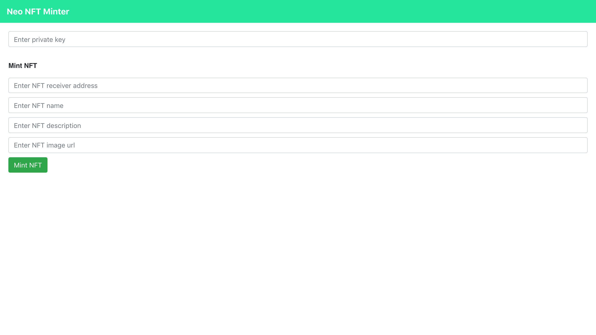
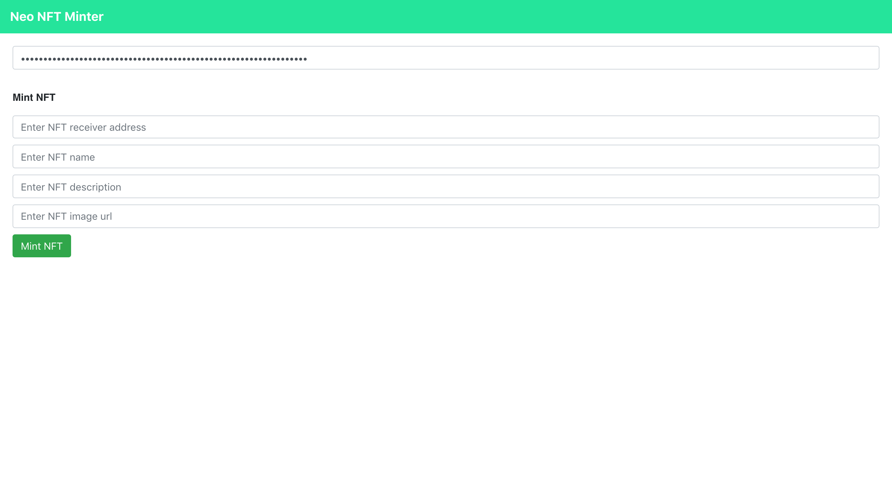
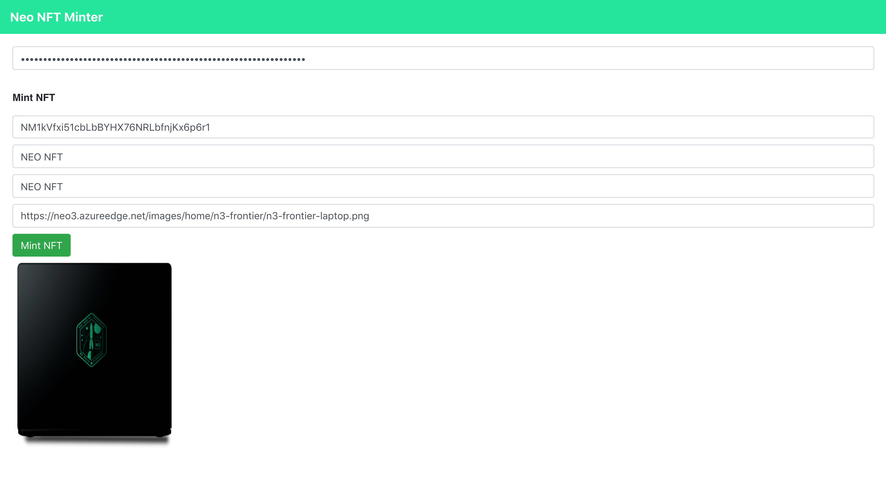
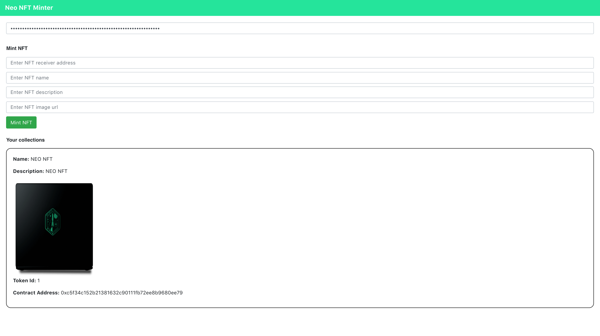

## Neo NFT Minter
Neo NFT Minter allows you to easily mint an NFT and send it to an address. 
You can also view the NFTs owned by your account.

All credits go to https://github.com/viraja1

### Screenshots








### Getting Started

1) Clone the repo

   ```
   git clone https://github.com/viraja1/neo_nft_minter.git 
   ```
   
2) Change Directory

   ```
   cd neo_nft_minter
   ```
   
3) Ensure that python 3.7 or above is installed
 
   Make a Python 3 virtual environment and activate it:
   
   On Windows: 
   
   $ python3 -m venv venv
   $ venv\Scripts\activate.bat
   
   On Linux / MacOS:
   
   $ python3 -m venv venv
   $ source venv/bin/activate


4) Compile the contracts

   ```
   cd contracts
   pip install -r requirements.txt
   neo3-boa nft.py
   ```
   
5) Launch the private net container where the compiled contract can be deployed

   ```
   docker-compose build
   docker-compose up -d
   ```
   
6) View the container logs in a new terminal tab

   ```
   docker logs -f neo
   ```
   
7) Deploy the contract inside the container from a new terminal tab

   ```
   docker exec -it neo bash
   
   ./neo-express/src/neoxp/bin/Debug/net5.0/neoxp wallet create coz
   ./neo-express/src/neoxp/bin/Debug/net5.0/neoxp transfer 10000 GAS genesis coz
   ./neo-express/src/neoxp/bin/Debug/net5.0/neoxp contract deploy /contracts/nft.nef coz
   ./neo-express/src/neoxp/bin/Debug/net5.0/neoxp contract list
   ./neo-express/src/neoxp/bin/Debug/net5.0/neoxp contract storage nft
   ./neo-express/src/neoxp/bin/Debug/net5.0/neoxp wallet list
   ```
   
   Note down the value for the NFT contract address and the private key for the coz account from the last 2 steps above.
   Copy the NFT contract address value, remove 0x from the start and then update the CONTRACT_HASH value in client/src/App.js:6
   
8) Go back to the neo_nft_minter folder in a separate terminal tab to build the client app
   ```
   cd neo_nft_minter
   ```
  
   cd client
   npm install
   npm start 
   ```
   
9) Test the app
   
   http://localhost:3000/ 
